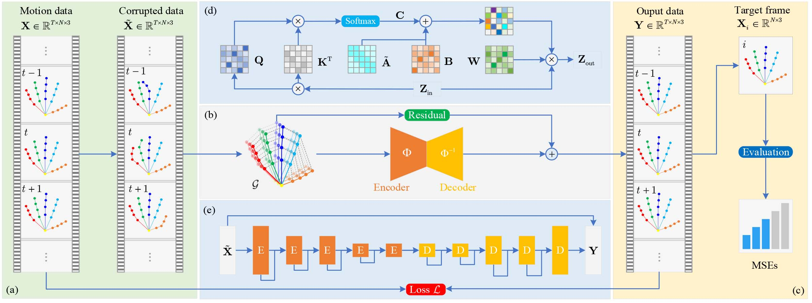

# STGAE

The implementation of *STGAE: Spatial-Temporal Graph Auto-Encoder for Hand Motion Denoising* in ISMAR 2021.

## Abstract

Hand object interaction in mixed reality (MR) relies on the accurate tracking and estimation of human hands, which provide users with a sense of immersion. However, raw captured hand motion data always contains errors such as joints occlusion, dislocation, high-frequency noise, and involuntary jitter. Denoising and obtaining the hand motion data consistent with the user’s intention are of the utmost importance to enhance the interactive experience in MR. To this end, we propose an end-to-end method for hand motion denoising using the spatial-temporal graph auto-encoder (STGAE). The spatial and temporal patterns are recognized simultaneously by constructing the consecutive hand joint sequence as a spatial-temporal graph. Considering the complexity of the articulated hand structure, a simple yet effective partition strategy is proposed to model the physic-connected and symmetry-connected relationships. Graph convolution is applied to extract structural constraints of the hand, and a self-attention mechanism is to adjust the graph topology dynamically. Combining graph convolution and temporal convolution, a fundamental graph encoder or decoder block is proposed. We finally establish the hourglass residual auto-encoder to learn a manifold projection operation and a corresponding inverse projection through stacking these blocks. In this work, the proposed framework has been successfully used in hand motion data denoising with preserving structural constraints between joints. Extensive quantitative and qualitative experiments show that the proposed method has achieved better performance than the state-of-the-art approaches.

[Paper Address](https://ieeexplore.ieee.org/document/9583812) | [Download Paper](http://dro.dur.ac.uk/33610/1/33610.pdf?DDD4+DDC116+vbdv77) | [Supplementary Video](https://www.bilibili.com/video/BV1Pb4y1r7NV?spm_id_from=333.999.0.0)

## Framework



## Experiments

- Denoising results


## Environments

- `LaTeX` tool

```bash
sudo apt-get install texlive-full
```

- `FFmpeg`

```bash
sudo apt-get install ffmpeg
```

- `pydot & graphviz`
```bash
sudo pip3 install pydot
sudo pip3 install graphviz
```

## Citation

```latex
@INPROCEEDINGS{stage2021,
  author={Zhou, Kanglei and Cheng, Zhiyuan and Shum, Hubert P. H. and Li, Frederick W. B. and Liang, Xiaohui},
  booktitle={2021 IEEE International Symposium on Mixed and Augmented Reality (ISMAR)}, 
  title={STGAE: Spatial-Temporal Graph Auto-Encoder for Hand Motion Denoising}, 
  year={2021},
  volume={},
  number={},
  pages={41-49},
  doi={10.1109/ISMAR52148.2021.00018}
}
```

## Contact

Feel free to contact me at `zhoukanglei@qq.com`.